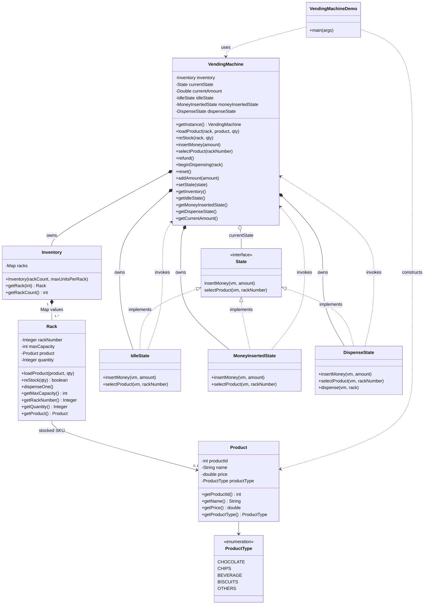

# Vending Machine — Class Diagram

---

## Legend

| Symbol / relation | Meaning |
|-------------------|--------|
| `*--` | **Composition** — lifecycle owned by parent (`VendingMachine` owns `Inventory` and concrete states). |
| `o--` | **Aggregation / association** — `currentState` references the active `State` implementation. |
| `*--` Inventory–Rack | `Inventory` creates and holds all `Rack` instances in a `Map<Integer, Rack>`. |
| `-->` Rack–Product | Each rack points to **at most one** `Product` (the SKU in that slot). |
| `..>` | **Dependency** — demo and states call methods on `VendingMachine` (and `Product` in demo). |
| `State` implementors | **State pattern** — behaviour of `insertMoney` / `selectProduct` depends on `currentState`. |

---

## Sequence note (not shown on class diagram)

`MoneyInsertedState.selectProduct` may call `setState(dispenseState)` and then `beginDispensing(rack)`, which delegates to `DispenseState.dispense(...)`. Exact ordering matches your `VendingMachine` / state code.

---

## Export as image

- **Mermaid Live Editor:** [mermaid.live](https://mermaid.live) — paste the diagram block, export PNG/SVG.
- **IDE:** Markdown preview with Mermaid support often has export.
- **PlantUML:** If you need `.puml`, the same structure maps one-to-one to `class` blocks and relations.